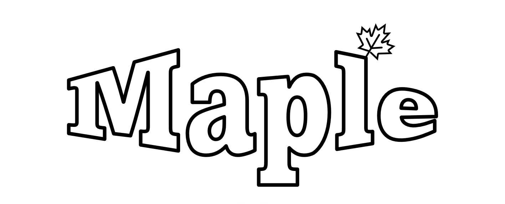
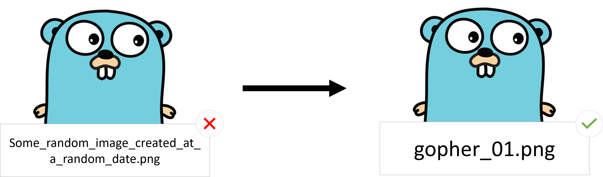

    
     
    

---

Maple is a file renamer that ensure prefix homogeneity across every file in a folder.  

    

## Download
👉 [Jump to release](https://github.com/KyllianBeguin/maple/releases/latest) 👈

## How to use ?
- [ ] Put maple in the folder where your files are
- [ ] Run it
    * Windows = Click on the .exe
    * Linux = Run `./maple-<MY_VERSION>`
- [ ] Give a prefix as asked by the program !
- [ ] Aaand voilà ! 🚀

## About
Maple is a little tool created to learn some basic Golang programming. And I also wanted a program that would rename a ton of files ¯\\_(ツ)_/¯